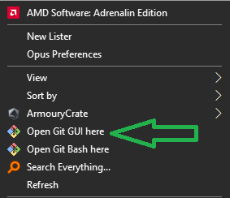
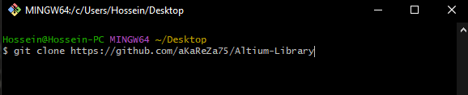
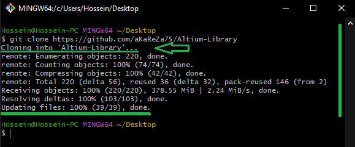
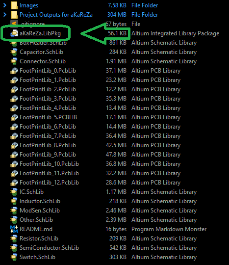
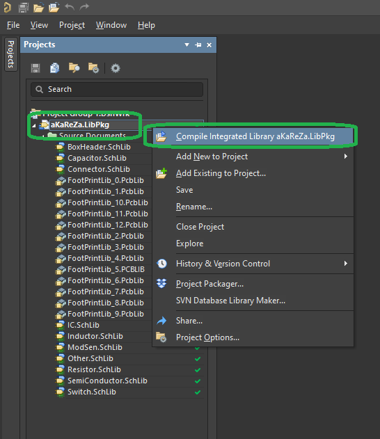
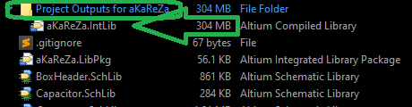
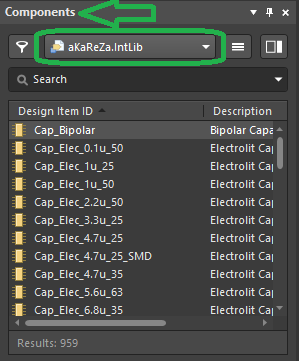
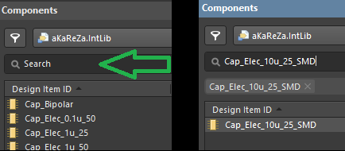
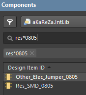
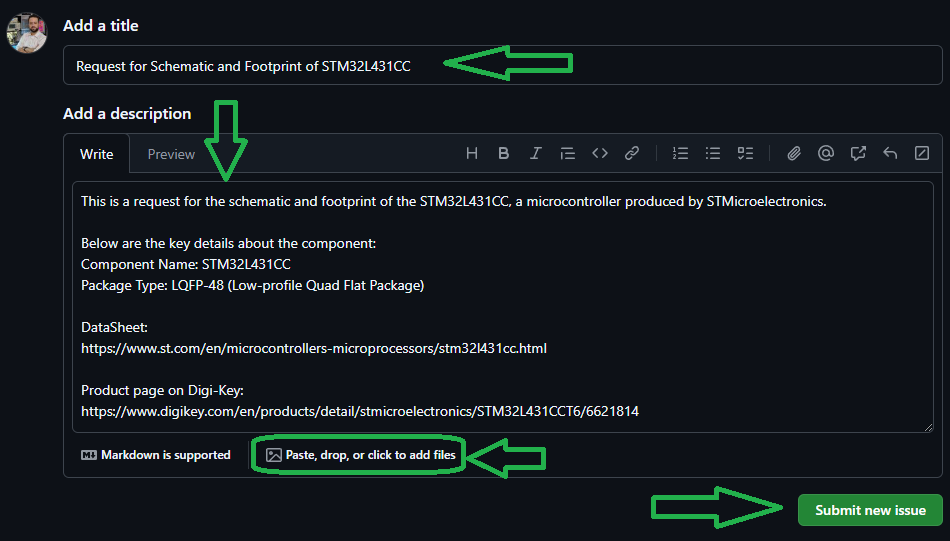

# aKaReZa Altium Designer Library
This repository contains a comprehensive library package for **Altium Designer**, designed for my personal PCB design projects.  
It has been shared as a special gift for reaching 1,000 subscribers on my YouTube channel. 🎉

# 📜 Features
- **High-Quality Components**: Includes optimized symbols, footprints, and 3D models for various designs.
- **Ready-to-Use**: Easily integrated with your Altium projects.
- **Organized Structure**: Well-categorized components for quick search and reuse.
- **Compact and Lightweight**: This compact library includes the most commonly used components, making it efficient and easy to work with.
- **Tested Components**: The majority of the components in this library have been tested in practical projects to ensure reliability and functionality. 

# 💻 How to Use
## 1. Clone the Repository
To access the repository files and save them on your computer, there are two methods available:
1. **Using Git Bash and Cloning the Repository**
   - This method is more suitable for advanced users and those familiar with command-line tools.
   - By using this method, you can easily receive updates for the repository.

2. **Downloading the Repository as a ZIP file**
   - This method is simpler and suitable for users who are not comfortable with command-line tools.
   - Note that with this method, you will not automatically receive updates for the repository and will need to manually download any new updates.

### Clone using the URL.
First, open **Git Bash** :
-  Open the folder in **File Explorer** where you want the library to be stored.
-  **Right-click** inside the folder and select the option **"Open Git Bash here"** to open **Git Bash** in that directory.



> [!NOTE] 
> If you do not see the "Open Git Bash here" option, it means that Git is not installed on your system.  
> You can download and install Git from [this link](https://git-scm.com/downloads).  
> For a tutorial on how to install and use Git, check out [this video](https://youtu.be/BsykgHpmUt8).
  
-  Once **Git Bash** is open, run the following command to clone the repository:

 ```bash
git clone https://github.com/aKaReZa75/Altium-Library
```
- You can copy the above command by either:
- Clicking on the **Copy** button on the right of the command.
- Or select the command text manually and press **Ctrl + C** to copy.
- To paste the command into your **Git Bash** terminal, use **Shift + Insert**.



- Then, press Enter to start the cloning operation and wait for the success message to appear.



> [!IMPORTANT]
> Please keep in mind that the numbers displayed in the image might vary when you perform the same actions.  
> This is because repositories are continuously being updated and expanded. Nevertheless, the overall process remains unchanged.

> [!NOTE]
> Advantage of Cloning the Repository:  
> - **Receiving Updates:** By cloning the repository, you can easily and automatically receive new updates.  
> - **Version Control:** Using Git allows you to track changes and revert to previous versions.  
> - **Team Collaboration:** If you are working on a project with a team, you can easily sync changes from team members and collaborate more efficiently.  

### Download Zip
If you prefer not to use Git Bash or the command line, you can download the repository directly from GitHub as a ZIP file.  
Follow these steps:  
1. Navigate to the GitHub repository page and Locate the Code button:
   - On the main page of the repository, you will see a green Code button near the top right corner.

2. Download the repository:
   - Click the Code button to open a dropdown menu.
   - Select Download ZIP from the menu.

    

3. Save the ZIP file:
   - Choose a location on your computer to save the ZIP file and click Save.

4. Extract the ZIP file:
   - Navigate to the folder where you saved the ZIP file.
   - Right-click on the ZIP file and select Extract All... (Windows) or use your preferred extraction tool.
   - Choose a destination folder and extract the contents.

5. Access the repository:
   - Once extracted, you can access the repository files in the destination folder.

> [!IMPORTANT]
> - No Updates: Keep in mind that downloading the repository as a ZIP file does not allow you to receive updates.    
>   If the repository is updated, you will need to download it again manually.  
> - Ease of Use: This method is simpler and suitable for users who are not comfortable with Git or command-line tools.

## 2. Open the Library File
Open the **`aKaReZa.LibPkg`** file in **Altium Designer**.



## 3. Compile the Library
To compile the library:
1. Open the **Projects** from the **Panels** menu.
2. In the Projects panel, locate the file **`aKaReZa.LibPkg`**.
3. Right-click on the file and select **Compile Integrated Library aKaReZa.LibPkg**.
4. Wait for the compilation process to finish.



### 4. Verify Compilation
After successful compilation:
- The integrated library file will be saved in the **`Project Outputs for aKaReZa`** folder.



- You can now see and use the library in the **Components** of Altium Designer.
  



# 📂 Repository Contents
The library structure consists of the following files:

### 1. `aKaReZa.LibPkg`
- This is the main **integrated library package** file.
- Used for compiling all symbols, footprints, and 3D models into a single file.
- Once compiled, it generates an integrated library ready for use in Altium Designer.

### 2. `BoxHeader.SchLib`
- Contains schematic symbols for **box header connectors**.
- Includes various pin configurations such as 2x3, 2x5, and others.
- This file also includes male and female header pins, as well as FPC connectors.
  
### 3. `Capacitor.SchLib`
- Includes schematic symbols for a wide range of capacitors.
- Categories include ceramic, electrolytic, tantalum, and film capacitors.

### 4. `Connector.SchLib`
- Provides symbols for various types of connectors, including programmers, Arduino, power connectors, computer connectors, signal connectors, antenna connectors, and SIM card connectors.

### 5. `FootPrintLib_X.PcbLib` (e.g., `FootPrintLib_1.PcbLib`)
- Contains PCB footprints for different components.
- Each file is categorized based on its component type or package size.

### 6. `IC.SchLib`
- Includes schematic symbols for integrated circuits (ICs).
- Examples: microcontrollers, regulators, and operational amplifiers.

### 7. `Inductor.SchLib`
- Schematic symbols for inductors, including power and signal types.

### 8. `ModSen.SchLib`
- Contains schematic symbols for various sensors, including temperature, light, and humidity sensors.
- Includes communication modules such as WiFi, Bluetooth, GPS, GSM, LoRa, and display modules like seven-segment displays and LCDs.

### 9. `Other.SchLib`
- Contains schematic symbols for motors, transformers, coil cores, heat sinks, batteries, and various electromechanical components.

### 10. `Resistor.SchLib`
- Contains schematic symbols for resistors.
- Includes standard resistors, arrays, and special-purpose types.

### 11. `SemiConductor.SchLib`
- Includes transistors, diodes, optoelectronic components, LEDs, triacs, thyristors, and MOSFETs.

### 12. `Switch.SchLib`
- Schematic symbols for switches, push buttons, relays, and optocouplers.


# 🔍 Searching Components in the Library
In this library, components are named using specific conventions to make searching and identifying them more efficient. 
By following these structured naming conventions, you can quickly locate and understand each component within the library.

The naming conventions are as follows:
1. **Component Type**: For example, `Cap` for capacitors.
2. **Subcategory**: e.g., `Elec` for electrolytic capacitors.
3. **Packaging Type**: e.g., `SMD` for surface-mount devices and `THT` for through-hole technology.
4. **Value and Size**: For components with specific values, the value and size will also be included in the name.

> [!TIP]
> To search for the component name, use the Component section in the Panel in Altium.



```plaintext
📦 Component Examples
├── Capacitors
│   ├── Electrolytic Capacitors: 
│       ├── Surface-mount (SMD)
│           └── Cap_Elec_10u_25_SMD → 10µF, 25V SMD Electrolytic Capacitors
├── Resistors
│   └── SMD Resistors
│       └── Res_SMD_0805 → SMD Resistor package 0805
├── Microcontrollers
│   └── STM32F103C8T6: 
│       └── IC_MCU_STM32F103C8T6 → 32bit ST Microcontroller, based on ARM Cortex-M3 core
├── Transistors
│   └── BJT Transistors
│       ├── SMD
│           └── Semi_BJT_2N2222_SMD → SMD Transistor 2N2222
```

> [!NOTE]
> For better search results in Altium, it is recommended to use `*` instead of `_`. For example, searching for `Res*0805` will bring up all 0805 resistors, whereas searching for `Res_0805` may not return any results.  
> When using underscores (`_`), you need to enter the exact name of the component as it appears in the library.  
> However, with an asterisk (`*`), you can search for partial matches, and Altium will find and display all similar components based on the entered terms.



The overall structure of the aKaReZa library is as
```plaintext
📦 aKaReZa Library Structure
├── Capacitors
│   ├── Electrolytic Capacitors: `Cap_Elec`
│   ├── Bipolar Capacitors: `Cap_Bipolar`
│   ├── MKT Capacitors: `Cap_MKT`
│   ├── Multi-Layer Capacitors: `Cap_Multi`
│   ├── Polyester Capacitors: `Cap_Poly`
│   ├── Tantalum Capacitors: `Cap_Tantalum`
│   └── Variable Capacitors: `Cap_Var`
├── Resistors
│   ├── THT Resistors: `Res_Value_THT`
│   ├── SMD Resistors: `Res_Value_SMD`
│   ├── Multi-Turn Resistors: `Res_Multi`
│   ├── Network Resistors: `Res_Network`
│   └── Potentiometer: `Res_Pot`
├── Inductors
│   ├── THT Inductors: `Ind_THT`
│   └── SMD Inductors: `Ind_SMD`
├── Semiconductors
│   ├── Transistors
│   │   ├── BJT Transistors: `Semi_BJT`
│   │   └── Mosfet: `Semi_Mosfet`
│   ├── Diodes
│   │   ├── Generic Diodes: `Semi_Diode_STD`
│   │   ├── Fast Diodes: `Semi_Diode_Fast`
│   │   ├── Shottky Diodes: `Semi_Diode_Sch`
│   │   ├── Zener Diodes: `Semi_Diode_Zener`
│   │   ├── LED Diodes: `Semi_Diode_LED`
│   │   ├── TVS Diodes: `Semi_Diode_TVS`
│   │   ├── Diac: `Semi_Diode_Diac`
│   │   └── Full Bridge Rectifier: `Semi_Diode_Bridge`
│   ├── Thyristors
│   │   ├── Thyristor: `Semi_SCR`
│   │   └── Triac: `Semi_Triac`
├── Integrated Circuits (ICs)
│   ├── Microcontroller: `IC_MCU`
│   ├── Logic IC: `IC_Logic`
│   ├── Driver IC: `IC_Driver`
│   ├── Converter IC: `IC_Converter`
│   ├── Operational Amplifier: `IC_Opamp`
│   └── Regulator: `IC_Reg`
├── Switches and Relays
│   ├── Push Button: `SW_PushButton`
│   ├── On-off Switch: `SW_Power`
│   ├── DIP Switches: `SW_THT`
│   ├── Relays: `SW_Relay`
│   └── Opto Coupler: `SW_Opto`
├── Connectors
│   ├── Arduino Connector: `Con_Arduino`
│   ├── Audio Connector: `Con_Audio`
│   ├── FPC Connector: `Con_FPC`
│   ├── Female Pin Header Connector: `Con_FPH`
│   ├── Male Pin Header Connector: `Con_MPH`
│   ├── IDC Connector: `Con_IDC`
│   ├── Portable Computer Connector: `Con_PC`
│   ├── Power Connector: `Con_Power`
│   ├── Programmer Connector: `Con_Prog`
│   ├── RF Connector: `Con_RF`
│   └── USB Connector: `Con_USB`
├── Modules and Sensors
│   ├── 7Segments: `ModSen_7Seg`
│   ├── Communication Modules: `ModSen_Com`
│   └── Display: `ModSen_LCD`
└── Other Components
    ├── Crystals: `Other_Elec_Xtal`
    ├── Oscillators: `Other_Elec_Oscillator`
    ├── Batteries: `Other_Elec_Battery`
    ├── SMD Fuses: `Other_Elec_Fuse_SMD`
    ├── THT Fuses: `Other_Elec_Fuse_THT`
    ├── Cores: `Other_Core`
    ├── Enclosure: `Other_Mech_ENC`
    └── Heat Sink: `Other_Mech_HEATSINK`
```
By adhering to this convention, you can quickly locate any component while maintaining clarity and consistency in your designs.

# 🛠 Component Parameters
Each component in the library includes the following parameters:

| **Parameter**   | **Description**                                                                 |
|-----------------|---------------------------------------------------------------------------------|
| **Inflow**      | Internal inventory code of the component for warehouse management.              |
| **Package**     | The package type of the component (e.g., 1206, SOIC-8).                         |
| **Rating**      | Power rating of the component (e.g., 0.25W for resistors).                      |
| **Type**        | Specifies the type of component (e.g., NPN/PNP for transistors).                |
| **Validation**  | Indicates whether the component has been tested (Valid/NT - Not Tested).        |
| **Value**       | The key value or identifier (e.g., resistance for resistors, IC name).          |

> [!NOTE]
> For more information about **Inflow** and its usage, click [aKaReZa 29 - Q-A, The best way to manage Electronics Components Inventory](https://youtu.be/F4Bge-_tUWE).

# 🎥 Video Tutorials
For a complete video tutorial on how to use this library, visit my YouTube channel:  
📺 [How to Use the aKaReZa Library](https://youtu.be/l-yOpVmeKFw)

Learn how to create your personal Altium Designer library through these videos:
1. [aKaReZa 82 - PCB, Library - PART A](https://youtu.be/yt6wmXNhPHg)
   - First video in the series. Learn the tools for schematic and PCB design, creating integrated library projects, designing THT and SMD resistor symbols, adding 3D models, and compiling libraries.
   
2. [aKaReZa 84 - PCB, Library - PART B](https://youtu.be/dTeTpMkixJI)
   - Second video in the series. Covers schematic and footprint design for capacitors and inductors (THT, SMD, power, barrel), and using the Parameter Manager.

3. [aKaReZa 85 - PCB, Library - PART C](https://youtu.be/aoqMTQX8EtM)
   - Third video in the series. Learn to design schematic symbols and footprints for diodes, transistors, ICs (THT, SMD), designing multi-part components, and understand pin types and configurations.

4. [aKaReZa 86 - PCB, Library - PART D](https://youtu.be/wHq2v9WrjEQ)  
   - Final video. Learn to design for STM32 microcontroller, AMS1117 regulator, and LQFP-48 and SOT-223 packages. Includes using Footprint Wizards, setting reference points, and testing components.
   
These tutorials cover everything you need to know about library creation and integration.

# 🆕 Requesting New Components
To request a new component:
- Go to the **Issues** section of this repository.
- Create a new issue with the following details:
  - Component name
  - Package type
  - Key specifications
  - Additional notes or links to the datasheet.

- Example:
  - Let’s say we want to request the addition of the STM32L431CC microcontroller. Here’s how you can structure the issue:




Additionally, you can include:
- Component Image:
  If available, you can attach an image of the component to help visualize the part.
- Other Data:
  Feel free to add any additional relevant information such as application notes, pinout diagrams, or other resources that may help in designing the schematic and footprint.

Once the request is reviewed, it will be added to the library in future updates.

> [!TIP]
> While the examples provided above are in English, feel free to ask your questions in **Persian (فارسی)** as well.  
> There is no difference in how they will be handled!  

> [!NOTE]
> Pages and interfaces may change over time, but the steps to create an issue generally remain the same. 

# 🤝 Contributing to the Repository
To contribute to this repository, please follow these steps:
1. **Fork the Repository**  
2. **Clone the Forked Repository**  
3. **Create a New Branch**  
4. **Make Your Changes**  
5. **Commit Your Changes**  
6. **Push Your Changes to Your Forked Repository**  
7. **Submit a Pull Request (PR)**  

> [!NOTE]
> Please ensure your pull request includes a clear description of the changes you’ve made.
> Once submitted, I will review your contribution and provide feedback if necessary.

# 🌟 Support Me
If you found this repository useful:
- Subscribe to my [YouTube Channel](https://www.youtube.com/@aKaReZa75).
- Share this repository with others.
- Give this repository and my other repositories a star.
- Follow my [GitHub account](https://github.com/aKaReZa75).

# 📜 License
This project is licensed under the GPL-3.0 License. This license grants you the freedom to use, modify, and distribute the project as long as you:
- Credit the original authors: Give proper attribution to the original creators.
- Disclose source code: If you distribute a modified version, you must make the source code available under the same GPL license.
- Maintain the same license: When you distribute derivative works, they must be licensed under the GPL-3.0 too.
- Feel free to use it in your projects, but make sure to comply with the terms of this license.
  
# ✉️ Contact Me
Feel free to reach out to me through any of the following platforms:
- 📧 [Email: aKaReZa75@gmail.com](mailto:aKaReZa75@gmail.com)
- 🎥 [YouTube: @aKaReZa75](https://www.youtube.com/@aKaReZa75)
- 💼 [LinkedIn: @akareza75](https://www.linkedin.com/in/akareza75)

